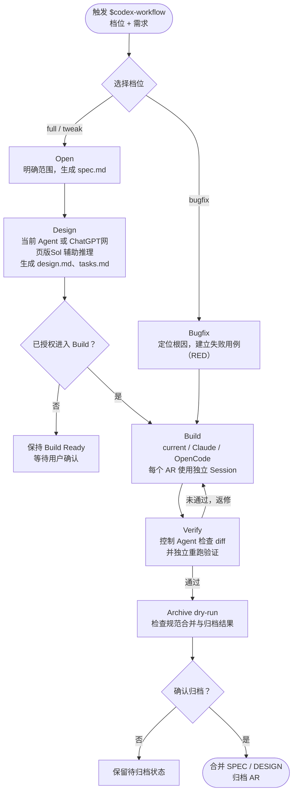

# Harness

Harness 是一组面向 AI 编程的规范驱动工作流。目前仓库包含两个版本：

- **codespec**：面向 Vibe Coding 的轻量、自包含规格驱动开发（SDD）工作流。
- **codex-workflow**：面向 ChatGPT 桌面版 Codex 的增强工作流，可选接入 ChatGPT网页版进行设计推理与 Claude Code/OpenCode 执行器。

两者都以“先明确需求和验收标准，再设计、实现、验证、归档”为核心，但复杂度和适用场景不同。

## codespec

codespec 是一套轻量的规格驱动开发（SDD）工作流：先用规格明确行为、边界和验收场景，再完成设计、实现与验证。TDD 作为实现保障按变更风险分级使用，而不是让所有任务都执行同样重量的流程。

### 三种档位

- `full`：完整 SDD。适用于新功能、跨模块改造或高风险变更，生成需求、设计和任务文档；Build 阶段按任务执行 TDD。
- `tweak`：轻量 SDD。适用于边界清晰的局部调整，保留需求和任务文档，仅在需要时补充设计；必须执行相关测试，但不强制每项任务先 RED。
- `bugfix`：最小 TDD。适用于不新增能力、不改变接口的纯缺陷，不创建工作流文档；执行“根因分析 → RED → 最小修复 → GREEN → 回归验证”闭环。

### 使用方式

```text
/codespec full 实现企业单点登录
/codespec tweak 为用户列表增加状态筛选
/codespec bugfix 修复并发更新导致的数据覆盖
```

### 文档结构

```text
codespec/
├── SPEC.md
├── DESIGN.md
├── .codespec/
│   └── config.yaml
└── changes/
    └── codespec-001-example/
        ├── .codespec.yaml
        ├── spec.md
        ├── design.md      # full 或确有设计需要时生成
        └── tasks.md
```

以上变更目录用于 `full` 和 `tweak`；`bugfix` 直接进入最小 TDD 路径，不创建 CodeSpec 变更目录。


## codex-workflow

codex-workflow 在规范治理之上增加了角色分工和执行器编排：控制 Agent 负责需求、设计决策、状态推进、独立验证与归档；Reasoner 只提供设计输入；Executor 只负责代码和测试实现。

### 执行流程



### 关键设计

- **控制权不外包**：ChatGPT网页版Sol 提供建议和设计，最终设计由控制 Agent 核对；外部 Executor 完成实现，最终结果由控制 Agent 重新检查和验证。
- **首次确认后复用默认值**：项目第一次进入 Build 时确认执行器，随后保存为项目默认配置，不在每次变更中重复询问。
- **每个 AR 一个 Session**：同一 AR 的实现和返修复用一个执行器会话，提高上下文与缓存命中率；不同 AR 相互隔离，避免旧任务污染。
- **不静默降级**：Executor 不可用时明确停止并报告，不擅自切换模型或执行路径。
- **归档前确认**：先运行 dry-run 和一致性检查，只有用户确认后才更新主规范并归档。

### 使用方式

```text
$codex-workflow full 实现多租户权限体系
$codex-workflow tweak 调整订单审批规则
$codex-workflow bugfix 修复支付回调重复入账
```

首次使用时，工作流会根据当前阶段完成必要确认；后续可恢复活跃 AR，继续设计、Build、修复或归档。


## 依赖与数据边界

### codex-workflow

- 当前版本依赖 Superpowers 的 TDD、系统化调试和完成前验证能力，所以执行器agent需要安装superpower技能。
- ChatGPT网页版Sol仅在用户选择它作为 Reasoner 时需要，主要用于plus用户额度不够时利用ChatGPT网页版的5.6 Sol参与设计。
- Claude Code 或 OpenCode 仅在用户选择其作为 Executor 时需要；也可以由当前 Agent 直接执行。

工作流中的权限限制和路径检查主要用于防止误操作，不应被视为安全沙箱。生产项目仍应使用最小权限、分支保护、CI、代码审查和密钥扫描等工程控制。
