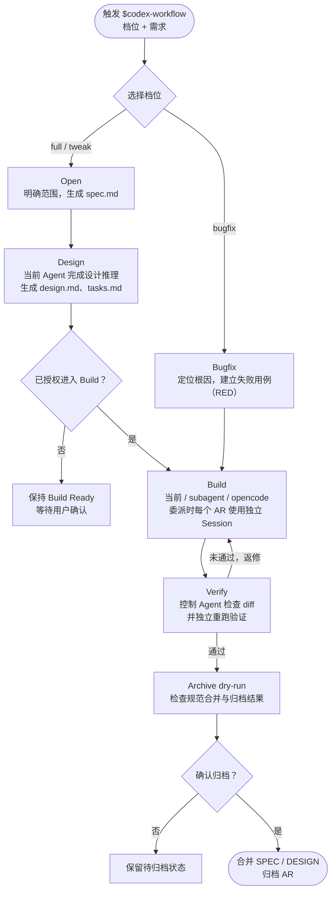

# Harness

Harness 是一组面向 AI 编程的规范驱动工作流。目前仓库包含两个版本：

- **codespec**：面向 Vibe Coding 的轻量、自包含规格驱动开发（SDD）工作流。
- **codex-workflow**：面向 ChatGPT 桌面版 Codex 的增强工作流，Design 由当前 Codex 完成，执行方式提供当前 Agent、原生 subagent、OpenCode 三选一，可选启用「审核-修复自动循环」。

两者都以“先明确需求和验收标准，再设计、实现、验证、归档”为核心，但复杂度和适用场景不同。

## codespec

codespec 是一套轻量的规格驱动开发（SDD）工作流：先用规格明确行为、边界和验收场景，再完成设计、实现与验证。TDD 作为实现保障按变更风险分级使用，而不是让所有任务都执行同样重量的流程。

### 三种档位

- `full`：完整 SDD。适用于新功能、跨模块改造或高风险变更，生成需求、设计和任务文档；Build 只按设计声明的实施 Phase 分批，每个 Phase 内按任务执行 TDD。
- `tweak`：轻量 SDD。适用于边界清晰的局部调整，保留需求和任务文档，仅在需要时补充设计；必须执行相关测试，但不强制每项任务先 RED。
- `bugfix`：最小 TDD。适用于不新增能力、不改变接口的纯缺陷，不创建工作流文档；执行“根因分析 → RED → 最小修复 → GREEN → 回归验证”闭环。

### 使用方式

```text
/codespec full 实现企业单点登录
/codespec tweak 为用户列表增加状态筛选
/codespec bugfix 修复并发更新导致的数据覆盖
```

### 文档结构

```text
codespec/
├── SPEC.md
├── DESIGN.md
├── .codespec/
│   └── config.yaml
└── changes/
    └── codespec-001-example/
        ├── .codespec.yaml
        ├── spec.md
        ├── design.md      # full 或确有设计需要时生成
        └── tasks.md
```

以上变更目录用于 `full` 和 `tweak`；`bugfix` 直接进入最小 TDD 路径，不创建 CodeSpec 变更目录。


## codex-workflow

codex-workflow 在规范治理之上增加了角色分工和执行器编排：控制 Agent 负责需求、设计决策、状态推进、独立验证与归档；Executor 只负责代码和测试实现。

### 执行流程



### 关键设计

- **控制权不外包**：设计与决策由当前控制 Agent 完成；外部 Executor 只负责实现，最终结果由控制 Agent 重新检查和验证。
- **首次确认后复用默认值**：项目第一次进入 Build 时确认执行器，随后保存为项目默认配置，不在每次变更中重复询问。
- **每个 AR 一个 Session**：同一 AR 的实现和返修复用一个执行器会话，提高上下文与缓存命中率；不同 AR 相互隔离，避免旧任务污染。subagent 使用原生完成通知；新 AR 的 OpenCode 使用插件内置 MCP Broker 管理项目级 Server，以 SSE 唤醒并用权威状态复核；旧 AR 或显式兼容配置仍可使用 CLI，有界等待规则保持不变。
- **不静默降级**：Executor 不可用时明确停止并报告，不擅自切换模型或执行路径。
- **归档前确认**：先运行 dry-run 和一致性检查，只有用户确认后才更新主规范并归档。

### 使用方式

```text
$codex-workflow full 实现多租户权限体系
$codex-workflow tweak 调整订单审批规则
$codex-workflow bugfix 修复支付回调重复入账
```

首次使用时，工作流会根据当前阶段完成必要确认；后续可恢复活跃 AR，继续设计、Build、修复或归档。


### OpenCode Server 插件架构

安装构建产物 `dist/codex-workflow-plugin` 后，Codex 同时获得 `codex-workflow` Skill 和本地 STDIO MCP Broker。Broker 按项目根目录启动独立的 OpenCode Server，并按 AR 创建独立 Session：

```text
Codex 控制 Agent → MCP Broker → 项目级 OpenCode Server → AR Session
        ↑                                             ↓
        └──── SSE 唤醒 + 权威状态 + diff/测试独立验收 ────┘
```

用户不需要手动启动 `opencode serve`，但仍需预先安装 OpenCode 并配置 Provider/模型凭据。插件不打包 OpenCode 二进制，也不接管凭据。不同项目分别启动 Server，避免工作目录、权限和 Session 相互污染。

构建：

```text
node scripts/build-codex-workflow-plugin.mjs
```

插件产物会复制唯一的 `codex-workflow` Skill，并将 MCP Broker 打包为 `mcp/index.js`；不提交 `node_modules`，安装后不依赖仓库外相对路径。

`opencode_session_send_bound` 只表示任务已接受；控制 Agent 通过 `opencode_session_wait` 等待状态变化，超时不是成功。Session 完成后仍必须执行 codespec 越权检查、真实 diff 检查和独立测试，MCP 返回文本不能替代验收。


Server Build 在建立 AR 绑定并完成 Git 前置后创建 codespec snapshot；发送任务使用 `opencode_session_send_bound`，传入 Phase ID、prompt 和已知 revision，由 Broker 解析 Session 并计算完整任务批次，避免控制 Agent 手写 Session ID 或拆分 Phase。控制 Agent 只负责独立 diff、测试和状态验收，外部 Worker 负责产品源码与测试实现。

### 后续计划：接入网页版 ChatGPT 5.6 Sol

后续计划将网页版 ChatGPT 5.6 Sol 作为可选的外部设计与代码审核顾问，加入 Design 和 Verify 阶段：

- **Design**：将需求、项目约束和当前规范快照发送给 Sol，获取架构方案、风险提示和设计挑战意见；控制 Agent 整理并确认后，才写入 `design.md` 和 `tasks.md`。
- **Verify**：每个 Phase 完成后生成代码 diff、测试结果和验收上下文，发送给 Sol 做独立代码审核；审核意见落盘为 review 记录，由控制 Agent 判断是否返修、跳过或进入下一阶段。
- **边界**：Sol 只提供建议，不直接修改代码、规范或执行器状态；所有发送动作需要用户明确授权，凭据和浏览器会话留在宿主环境，不写入仓库。

实现上计划通过独立的 ChatGPT Web 适配层完成浏览器会话、模型选择、上下文发送和结果回收，Skill 负责定义调用时机与输入输出契约，MCP Broker 继续只负责 OpenCode 执行和状态交接，不把网页版 ChatGPT相关流程打包进 MCP。

### 安装到 ChatGPT 桌面版

构建完成后，在 Codex/ChatGPT 桌面版中直接发送下面这一句话，让模型自动登记本地 Marketplace、安装插件并完成基础验证：

> 请将当前仓库构建产物 `dist/codex-workflow-plugin` 安装到当前 ChatGPT 桌面版，自动完成本地 Marketplace 登记和插件安装；安装完成后验证 `codex-workflow` Skill 以及 MCP 工具是否可用。

构建命令：

```powershell
node scripts/build-codex-workflow-plugin.mjs
```

安装时应使用 `dist/codex-workflow-plugin/`，不要直接使用 `plugin/codex-workflow/` 源码目录。修改插件代码后重新构建，再重复上述提示词即可刷新安装内容。
## 依赖与数据边界

### codex-workflow

- 当前版本依赖 Superpowers 的 TDD、系统化调试和完成前验证能力，所以执行器agent需要安装superpower技能。
- 可选「审核-修复自动循环」仅适用于 full/tweak AR 且绑定 OpenCode Server 的场景；整体无轮数上限，同一问题完成三次修复仍未解决则暂缓并集中反馈，不自动提交、推送或归档。
- 执行器选择优先显示按钮，不可用时回复序号：`1 当前`、`2 subagent`、`3 opencode`。subagent 需要宿主原生子代理能力，模型沿用宿主配置；OpenCode 仅在选用时需要安装。旧 Claude Code 默认值与会话保留兼容，但不出现在新菜单。

工作流中的权限限制和路径检查主要用于防止误操作，不应被视为安全沙箱。生产项目仍应使用最小权限、分支保护、CI、代码审查和密钥扫描等工程控制。
