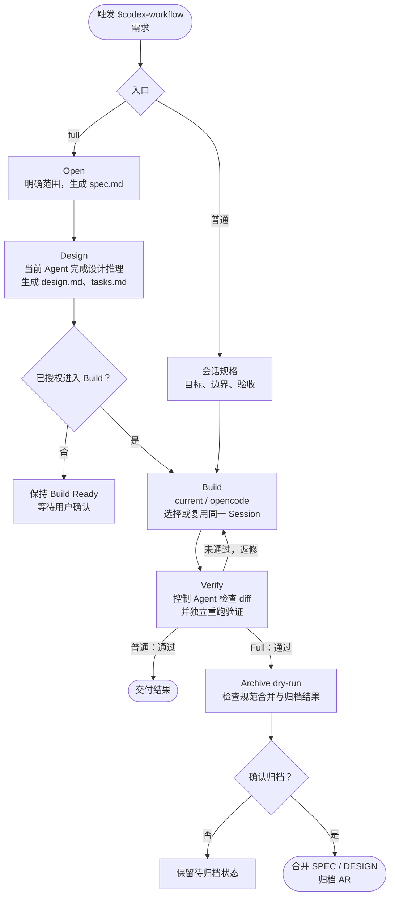

# Harness

Harness 是一组面向 AI 编程的规范驱动工作流。目前仓库包含两个版本：

- **codespec**：面向 OpenCode/Claude 的规格驱动开发（SDD）工作流，默认提供轻量会话内闭环。
- **codex-workflow**：面向 ChatGPT 桌面版 Codex 的增强工作流，Design 由当前 Codex 完成，Build 仅提供当前 Agent 和 OpenCode，可选启用「审核-修复自动循环」。

两者都重视明确需求和验收标准；codespec 的普通档面向简单需求，full 使用完整的规格、设计、任务和归档流程。

## codespec

codespec 是规格驱动开发（SDD）工作流，面向 OpenCode/Claude。默认在当前会话内明确目标、边界和验收条件，读取已有实现后直接完成必要的实现与验证；不把普通请求自动升级为完整治理流程。

### 两种档位

- 普通档：调用 `/codespec <需求>`。适用于新项目、简单需求、bug 和小范围实现；项目初始化状态、新能力或跨文件变更不会自动升级为 `full`。会话内明确目标、非目标、影响边界和验收条件，先读已有实现，只有关键缺口才询问，并可直接实现。不生成 spec/design/tasks/verification、规划、状态或归档文件，不初始化 codespec；产品文档仍可按需求修改。bug 采用最小 RED → GREEN → 回归验证闭环。
- `full`：调用 `/codespec full <需求>`，或明确要求完整规格治理时使用的完整 SDD。生成并维护 spec、design、tasks、状态和验证归档，按阶段实现、验证并归档；仅恢复有效 full 变更。


### 使用方式

```text
/codespec full 实现企业单点登录
/codespec 为用户列表增加状态筛选
/codespec 修复并发更新导致的数据覆盖
```

### 文档结构

```text
codespec/
├── SPEC.md
├── DESIGN.md
├── .codespec/
│   └── config.yaml
└── changes/
    └── codespec-001-example/
        ├── .codespec.yaml
        ├── spec.md
        ├── design.md
        └── tasks.md
```

以上变更目录仅用于显式 `full`；普通档不创建 CodeSpec 变更目录或状态文件。


## codex-workflow

codex-workflow 在完整规范治理之外提供会话内普通实现：控制 Agent 负责需求边界、Executor 决策和独立验收；Executor 负责代码与测试实现。

### 执行流程



### 关键设计

- **控制权不外包**：设计与决策由当前控制 Agent 完成；外部 Executor 只负责实现，最终结果由控制 Agent 重新检查和验证。
- **Executor 选择与复用**：普通入口缺少配置时在 `codespec/.codespec/config.yaml` 原子创建 `default_executor: ask`，并询问选择；旧 AR 配置忽略且不迁移。已有普通 session 复用原 Executor、agent 和 session。用户指定 OpenCode session ID 时用 CLI adoption 校验项目目录后绑定原 ID，不自动创建新 session或改走 Server。Full 按 AR 绑定执行器和 session。
- **独立验收**：Worker 完成或 Server 接收只表示执行状态，控制 Agent 仍检查真实 diff 并独立重跑测试。
- **不静默降级**：Executor 不可用时明确停止并报告，不擅自切换模型或执行路径。
- **Full 归档前确认**：先运行 dry-run 和一致性检查，只有用户确认后才更新主规范并归档。

### 使用方式

```text
$codex-workflow 实现用户列表状态筛选
$codex-workflow 修复支付回调重复入账
$codex-workflow full 实现多租户权限体系
```

普通入口不创建或恢复 AR，不写 spec/design/tasks/verification；需求中的新项目或跨文件实现也不会自动升级为 full。只有显式 full 才进入 AR 初始化、恢复、完整 Verify 和归档。


### OpenCode Server 插件架构

安装构建产物 `dist/codex-workflow-plugin` 后，Codex 同时获得 `codex-workflow` Skill 和本地 STDIO MCP Broker。Broker 按项目根目录启动独立的 OpenCode Server：Full 按 AR 创建独立 Session，普通入口通过 `opencode_run` 按 `ordinary:<runKey>` 管理 session，不创建或依赖 AR：

```text
Codex 控制 Agent → MCP Broker → 项目级 OpenCode Server → AR Session
        ↑                                             ↓
        └──── SSE 唤醒 + 权威状态 + diff/测试独立验收 ────┘
```

用户不需要手动启动 `opencode serve`，但仍需预先安装 OpenCode 并配置 Provider/模型凭据。插件不打包 OpenCode 二进制，也不接管凭据。不同项目分别启动 Server，避免工作目录、权限和 Session 相互污染。

构建：

```text
node scripts/build-codex-workflow-plugin.mjs
```

插件产物会复制唯一的 `codex-workflow` Skill，并将 MCP Broker 打包为 `mcp/index.js`；不提交 `node_modules`，安装后不依赖仓库外相对路径。

`opencode_session_send_bound` 只表示任务已接受；控制 Agent 通过 `opencode_session_wait` 等待状态变化，超时不是成功。Session 完成后仍必须执行 codespec 越权检查、真实 diff 检查和独立测试，MCP 返回文本不能替代验收。


Full Server Build 在建立 AR 绑定并完成 Git 前置后创建 codespec snapshot；发送任务使用 `opencode_session_send_bound`，传入 Phase ID、prompt 和权威 revision，由 Broker 解析 Session 并计算完整任务批次，避免控制 Agent 手写 Session ID 或拆分 Phase。普通 Server 使用 `opencode_run` 和 `ordinary:<runKey>`，不依赖 AR；控制 Agent 依据 Broker binding/status/revision 恢复或派发，并负责独立 diff、测试和状态验收，外部 Worker 负责产品源码与测试实现。

### 安装到 ChatGPT 桌面版

构建完成后，在 Codex/ChatGPT 桌面版中直接发送下面这一句话，让模型自动登记本地 Marketplace、安装插件并完成基础验证：

> 请将当前仓库构建产物 `dist/codex-workflow-plugin` 安装到当前 ChatGPT 桌面版，自动完成本地 Marketplace 登记和插件安装；安装完成后验证 `codex-workflow` Skill 以及 MCP 工具是否可用。

构建命令：

```powershell
node scripts/build-codex-workflow-plugin.mjs
```

安装时应使用 `dist/codex-workflow-plugin/`，不要直接使用 `plugin/codex-workflow/` 源码目录。修改插件代码后重新构建，再重复上述提示词即可刷新安装内容。
## 依赖与数据边界

### codex-workflow

- 普通和 full 的 Build 都支持 `current`、`opencode`；无配置时询问，已绑定 session 的修复继续使用原 Executor。
- 审核-修复自动循环只适用于显式 full 且绑定 OpenCode Server 的 AR；需要本次明确授权，不自动提交、推送或归档。

工作流中的权限限制和路径检查主要用于防止误操作，不应被视为安全沙箱。生产项目仍应使用最小权限、分支保护、CI、代码审查和密钥扫描等工程控制。
